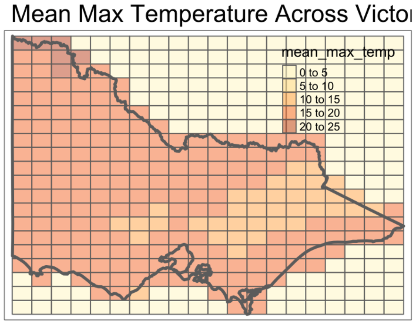

class: left, inverse, inverse
background-image: url(data/slides/monash-logo.jpeg), url(data/slides/fire_danger_title.jpg)
background-position: 90% 90%, 100% 0%
background-size: 40px, 100% 70%
background-color: #FFFFFF

```{r setup, include=FALSE}
# --- load libraries
library(tidyverse)
library(patchwork)
library(tmap)
library(knitr)
library(kableExtra)
library(tidymodels)
library(DT)
library(raster)

options(htmltools.dir.version = FALSE)
knitr::opts_chunk$set(
  fig.width=9, fig.height=3.5, fig.retina=3,
  out.width = "100%",
  cache = FALSE,
  echo = FALSE,
  message = FALSE, 
  warning = FALSE,
  hiline = TRUE
)
```

```{r load-data}
load(here::here("data/eda.RData"))
load(here::here("data/ida.RData"))
```


```{r xaringan-themer, include=FALSE, warning=FALSE}
library(xaringanthemer)
style_duo_accent(
  primary_color = "#000000",
  secondary_color = "#C760CE",
  header_background_color = "#C760CE"
)

xaringanExtra::use_panelset()
```

<br>
<br>
<br> 

.extralarge[.bold[.amber[.bg-main3[Development of Bushfire Risk Prediction]]]]
.extralarge[.bold[.amber[.bg-main3[Web App using Open Data in `r icons::fontawesome("r-project")`]]]]


.large[.bold[.amber[.bg-main3[Research Work as Part of ETC5543 Coursework]]]]

<br>
<br>
<br>
<br>
<br>
<br>

.right[<a href="https://www.thecourier.com.au/story/6597368/see-what-cartoonist-ditchy-thought-of-the-news-this-week/"> .black[Source:] .link-red[ The Courier]</a>]

.medium[.amber[.left[🕵 Brenwin Ang | 🕵 Helen Evangelina]]]
.medium[.amber[.left[Supervised by 👩 Prof. Di Cook | 🧑 Emily Dodwell]]]
.medium[.left[.amber[`r icons::fontawesome$brands$github` <a href="https://github.com/brenwin1"> @Brenwin1</a>]]]

???
Good afternoon everybody.

research work on ...
Joint work with Helen
Helen; talk about; modelling aspect; 

---

name: content-page
class: header_background

# Outline

<br>

.large[1️⃣ Background & Motivation]

.large[2️⃣ Data & Data Processing]

.large[3️⃣ App]

.large[4️⃣ Summary and Future work ]

---
class: center, middle, inverse

.mega[1️⃣:  🗺Background🥸]

---
# Background

## 😲Patrick's Honours Thesis👨‍🚀

.pull-left2[
```{r cause-map, out.width="200%", out.height="180%"}
au_map <- rnaturalearth::ne_states(country = 'Australia', returnclass = 'sf')
vic_map <- au_map[7,]

ggplot() +
  geom_sf(data = vic_map) +
  geom_point(data = cause_join_df %>% filter(bf_season == "2019-2020"),
             aes(x = lon,
                 y = lat,
                 colour = cause)) +
  scale_color_brewer(palette = "RdBu") +
  ggthemes::theme_map(base_size = 20) +
  theme(legend.position = "none")
```

]

--

.pull-right2[.extrasmall[
- Title: Using Remote Sensing Data 🛰 to Understand Fire Ignitions in Victoria during the 2019-2020 Australian Bushfire Season

- **Clustering Algorithm** to detect bushfire ignitions from satellite hotspot data, published in R package `spotoroo` and upcoming R Journal Article

- **Model** to predict the cause of bushfire ignition, using historical data, and metadata, temperature, precipitation, winds, radiation, vegetation/fuel layer, roads, recreation sites, CFA stations

- Shiny app ([VICfire web app]("https://ebsmonash.shinyapps.io/VICfire/")) for exploration of historical fire origins, predicted causes of 2019-2020 fires

- Research is an complementary extension of work done 

*All work conducted using open data and open source software (`r icons::fontawesome("r-project")`)
]]


???
work; continuation of Patrick's Honours thesis
which is; essentially; what we're working off of

clustering algorithm; which we'll be relying on heavily 

lightning, arson, burning off or accident

which lead to an app


---

# Motivation

.left-column[
```{r, out.width = "1000%", out.height = "1000%", eval=TRUE}
knitr::include_graphics("data/slides/home-destroyed-wildfire-pig-charlie-11.jpg")
```

]

--

.right-column[
- Victoria is one of the most fire-prone regions in the world (> 500 bushfires per year) 
  - affects 80% of Australians in some way [REF](https://theconversation.com/nearly-80-of-australians-affected-in-some-way-by-the-bushfires-new-survey-shows-131672)
  - harms millions of animals [REF](https://www.bbc.com/news/world-australia-53549936)

<br>
- Unprecedented 2019-2020 bushfires known colloquially as Black Summer
  - 244 species of animals have more than 50% of their habitat burnt
  - 3,000 homes destroyed
  - 33 lives lost
  
- Climate change escalating bushfire risk

> Effective bushfire management pivots around providing relevant and timely data to emergency management personnel and the public. - FFM Vic

]

???
Survey studies; by ANU; show; Australian adults are affected by bushfires 
 whether is it direct damage or smoke or feel anxious or worried
 also harms our precious wildlife

- Monitoring, Evaluation and Reporting Framework


---
class: center, middle, inverse

.megabold[👩‍💻Data and Data Processing👨‍💻 ]

`r icons::fontawesome("caret-right")` getting our data into format for modelling *hint: long form*🐛
`r icons::fontawesome("caret-right")` sourcing covariates into the same format🐛


---

# Current Data
## Fire Ignitions 🎇

.panelset[
.panel[.panel-name[Table]
```{r, fig.align='center', out.width="100%"}
set.seed(2)

# --- fire ignitions data
cluster_16_21_df %>% 
  filter(!is.na(bf_season)) %>% 
  sample_n(50) %>% # sample 50 random points 
  arrange(bf_season) %>% 
  knitr::kable(format = "html",
               booktabs = T,
               align = "c") %>% 
  kableExtra::kable_styling(full_width = F,
                            bootstrap_options = c("striped", "hover"),
                            font_size = 15) %>% 
  kableExtra::scroll_box(width = "750px",
                         height = "500px")
```

- 50 random fire ignitions detected from clustering algorithm since year 2016
- each row represent a fire ignition at a corresponding location specified by `lat` & `lon`
- An average of 715 bushfires detected each year
]

.panel[.panel-name[Plots]
```{r fire-ig-bar, out.width = "80%", out.height = "50%", eval=TRUE}
tmap::tm_shape(cluster_16_21_sf) +
  tm_bubbles(size = 0.1) +
  tm_facets(by = "bf_season") +
  tm_shape(vic_map) +
  tm_borders(lwd = 3) 
```

```{r, out.width = "50%", out.height = "50%", eval=TRUE}
# --- plot number of ignitions per bushfire season
cluster_16_21_df %>%
  filter(!is.na(bf_season)) %>%
  dplyr::select(bf_season) %>%
  group_by(bf_season) %>%
  mutate(total = n()) %>%
  distinct(bf_season, total) %>%
  ggplot() +
  geom_col(aes(x = factor(bf_season),
               y = total),
           width = 0.5) +
  theme_bw() +
  theme(axis.text.x = element_text(angle = 90)) +
  labs(x = "Bushfire Season",
       y = "Number of fire ignitions",
       title = "Number of fire ignitions over Bushfire Season ")
```
]
]

???
Since 2016 to 2021
50 out of about 3,500 fire ignition points 

---

# 🤔Considerations?🧐

--

**Spatial**
- chance of finding a bushfire ignition across Victoria is not spatially constant  
  - Example: chance of bushfire igniting in the city is virtually 0
  - Example: chance of bushfire igniting in the remote forests is high
--

- Weather and landscape is not the same across Victoria 

--

**Temporal**

--

- Bushfires occur mostly during "Bushfire Season" from September to March
  - filtered our data to bushfire seasons 

--

- although quite erratic over the years 

???
on the same token
Spatial & Temporal Distributions


---
layout: true
class: split-30 black 


.column.bg-main1[
.split-four[
.row.bg-main1[.content[
### Victoria map
]]
.row.bg-main2[.content[
### Grid Victoria map
]]
.row.bg-main3[.content[
### Overlay points
]]
.row.bg-main4[.content[
### Count the number of points in each grid cell
]]
]
]

.column[.content[
```{r, out.height="500"}
# --- make tmaps interactive
tmap::tmap_mode("view")

# --- plot Victoria map; in 20x20 grid cells
# as(vic_raster_crop_values_join$id, "SpatialPolygonsDataFrame") %>% # random raster; with Victoria bbox
#   sf::st_as_sf() %>% 
#   tmap::tm_shape(name = "grid cells") +
#   tmap::tm_polygons(alpha = 0.3,
#                     id = "id") +
  # --- draw outline of Victoria
  tmap::tm_shape(vic_map_sf,
                 name = "Victoria map outline") +
  tmap::tm_borders(lwd = 3) + # line width
  tmap::tm_layout(main.title = "Map of Victoria in 20x20 grid cells") +
  tmap::tm_basemap(leaflet::providers$OpenStreetMap)
```

- outline of Victoria map is plotted. 
- our window for analysis

]]

---
class: gray-row2-col1 gray-row3-col1 gray-row4-col1
count: false

---
layout: false
exclude: true
---
layout: true
class: split-30 black 

.column.bg-main1[
.split-four[
.row.bg-main1[.content[
### Victoria map
]]
.row.bg-main2[.content[
### Grid Victoria map
]]
.row.bg-main3[.content[
### Overlay points
]]
.row.bg-main4[.content[
### Count the number of points in each grid cell
]]
]
]

.column[.content[
```{r, out.height="500"}
# --- plot Victoria map; in 20x20 grid cells
as(vic_raster_crop_values_join$id, "SpatialPolygonsDataFrame") %>% # random raster; with Victoria bbox
  sf::st_as_sf() %>%
  tmap::tm_shape(name = "grid cells") +
  tmap::tm_polygons(alpha = 0.3,
                    id = "id") +
  # --- draw outline of Victoria
  tmap::tm_shape(vic_map_sf,
                 name = "Victoria map outline") +
  tmap::tm_borders(lwd = 3) + # line width
  tmap::tm_layout(main.title = "Map of Victoria in 20x20 grid cells") +
  tmap::tm_basemap(leaflet::providers$OpenStreetMap)
```

- 20 x 20 grid cells each used
- each grid approximately $0.451° \times 0.257°$ 
- only cells within Victoria were considered (all others set to `NA`)
]]

???
or $50km \times 28km$

---
class: gray-row3-col1 gray-row4-col1
count: false

---
layout: false
exclude: true

---
layout: true
class: split-30 black 

.column.bg-main1[
.split-four[
.row.bg-main1[.content[
### Victoria map
]]
.row.bg-main2[.content[
### Grid Victoria map
]]
.row.bg-main3[.content[
### Overlay points
]]
.row.bg-main4[.content[
### Count the number of points in each grid cell
]]
]
]

.column[.content[
```{r, out.height="500"}
# --- plot Victoria map; in 20x20 grid cells
as(vic_raster_crop_values_join$id, "SpatialPolygonsDataFrame") %>% # random raster; with Victoria bbox
  sf::st_as_sf() %>%
  tmap::tm_shape(name = "grid cells") +
  tmap::tm_polygons(alpha = 0.3,
                    id = "id") +
  
  # --- add ignition points (to buffer as necessary)
  tmap::tm_shape(cluster_16_21_sf %>% filter(bf_season == "2019-2020"),
                 name = "fire ignition points") +
  tmap::tm_bubbles(# col = "cause",
                   size = 0.2,
                   alpha = 0.1,
                   id = "") +
  
  # --- draw outline of Victoria
  tmap::tm_shape(vic_map_sf,
                 name = "Victoria map outline") +
  tmap::tm_borders(lwd = 3) + # line width
  tmap::tm_layout(main.title = "Map of Victoria in 20x20 grid cells") +
  tmap::tm_basemap(leaflet::providers$OpenStreetMap)
```

- each fire ignition is represented as a spatial point 
- overlayed on the window
]]

---
class: gray-row4-col1
count: false

---
layout: false
exclude: true

---
layout: false
class: split-30 black 

.column.bg-main1[
.split-four[
.row.bg-main1[.content[
### Victoria map
]]
.row.bg-main2[.content[
### Grid Victoria map
]]
.row.bg-main3[.content[
### Overlay points
]]
.row.bg-main4[.content[
### Count the number of points in each grid cell
]]
]
]

.column[.content[
```{r, out.height="500"}
# --- plot Victoria map; in 20x20 grid cells
ignition_rasterize_cluster_bf_season %>% 
  mutate(fire_count = case_when(
    fire_count == 0 ~ NA_real_,
    TRUE ~ fire_count)) %>% 
  filter(bf_season == "2019-2020") %>% 
  tmap::tm_shape(name = "cell fire ignition count") +
  tmap::tm_polygons(col = "fire_count",
                    id = "id",
                    style = "fixed",
                    breaks = c(0, 10, 20, 30, 40, 50),
                    palette = "YlOrRd",
                    alpha = 0.4,
                    colourNA = "grey",
                    legend.show = F) +
  
  # --- add ignition points (to buffer as necessary)
  tmap::tm_shape(cluster_16_21_sf %>% filter(bf_season == "2019-2020"),
                 name = "fire ignition points") +
  tmap::tm_bubbles(# col = "cause",
                   size = 0.2,
                   alpha = 0.1,
                   id = "") +
  
  # --- draw outline of Victoria
  tmap::tm_shape(vic_map_sf,
                 name = "Victoria map outline") +
  tmap::tm_borders(lwd = 3) + # line width
  tmap::tm_layout(main.title = "Map of Victoria in 20x20 grid cells") +
  tmap::tm_basemap(leaflet::providers$OpenStreetMap)
```


- For each cell, compute the number of bushfire ignitions (points)
- our response variable
]]


---

# applied to every bushfire season from 2016-2021
```{r}
tmap::tmap_mode("plot")

cluster_map_facet_bf_season
```

---
# Hang on ☝🏻... What about covariates?

```{r var-tab}
tibble::tribble(~data_source, ~variables, ~format, ~temporal_resolution, ~spatial_resolution,
                "SILO (https://www.longpaddock.qld.gov.au/silo/)", "max_temp, rh, radiation, et_short_crop, daily_rain", "NetCDF", "daily", "0.05° x 0.05°",
                
                "ERA5 Reanalysis data (https://cds.climate.copernicus.eu/cdsapp#!/dataset/reanalysis-era5-single-levels-monthly-means?tab=overview)", "lai_hv, lai_lv, WS10", "NetCDF" ,"monthly", "0.25° x 0.25°",
                
                "BoM's AWRA-L (http://www.bom.gov.au/water/landscape/#/sm/Actual/month/-26.32/132.54/3/Point/Separate/-15.6/130.25/2021/4/30/)", "s0_pct", "NetCDF", "monthly", "0.05° x 0.05°",
                
                "Department of Environment, Land, Water and Planning (DELWP) (https://discover.data.vic.gov.au/dataset/forest-types-of-victoria)", "vic_forest", "ShapeFile", "Periodic", "vector data") %>% 
  knitr::kable(format = "html",
               bookstabs = T,
               align = "c",
               caption = "data source, variables, format and temporal resolution used in this study") %>% 
  kableExtra::kable_styling(bootstrap_options = c("striped", "hover"),
                            full_width = F,
                            font_size = 15) %>% 
  kableExtra::scroll_box(width = "1100px",
                         height = "300px")
```

- A myriad of climate and landscape variables are used in our variables from different sources 

---
class: split-two white


# Supplementary Data

## ☂️Covariates 🏜

.pull-left[.content[
### For Numeric variables
```{r, fig.align="center"}
max_temp_df %>% 
  distinct(x, y) %>% 
  ggplot() +
  geom_tile(aes(x = x,
                y = y),
            colour = "white",
            lwd = 0.6,
            fill = "grey50") +
  ggthemes::theme_map() +
  theme(aspect.ratio = 0.85)
```

- values of cells within each larger cell aggregated using its mean

$$x = \frac{1}{n} \sum^n_{i=1} x_i$$

]]

.pull-right[.content[
### For categorical variables 
```{r}
tibble(x = 1, 
       y = 1) %>% 
  ggplot() +
  geom_tile(aes(x = x,
                y = y),
            colour = "white",
            fill = "grey50") +
  ggimage::geom_image(aes(x = 0.9,
                          y = 1,
                          image = "http://clipart-library.com/images/pTq8grApc.png"),
                      size = 0.3) +
  annotate(geom = "text",
           x = 1.15,
           y = 1,
           size = 15,
           colour = "black",
           label = "= 1") +
  ggthemes::theme_map() +
  theme(aspect.ratio = 0.85)
```
- create an indicator variable; 1 for positive cases and 0 otherwise

$$x = \begin{cases}1~~~ if\ forest\ exist\\ 0~~~ otherwise\end{cases}$$

]]

---

# Supplementary Data

## 🥵Example: Max Temperature🔥

```{r}

```


```{r, eval=FALSE}
# Example
max_temp_raster_crop %>% 
  raster::reclassify(rcl = cbind(NA, 0)) %>% # reclassify NA values to 0
  # raster -> spdf -> sf
  as(., "SpatialPolygonsDataFrame") %>% 
  sf::st_as_sf() %>%
  dplyr::select(X2021.05.01:X2021.05.31) %>% 
  # pivot_longer; change to tibble; since `pivot_longer` not compatible with `sf` yet
  as_tibble() %>% 
  mutate(id = 1:400,
         .before = "X2021.05.01") %>% 
  tidyr::pivot_longer(cols = X2021.05.01:X2021.05.31,
                      names_to = "date",
                      values_to = "max_temp") %>% 
  # to `sf`
  sf::st_as_sf() %>% 
  group_by(id) %>% 
  summarise(mean_max_temp = mean(max_temp)) %>% 
  tmap::tm_shape(.,
                 name = "max_temp cell") +
  tm_polygons(col = "mean_max_temp",
              alpha = 0.5) +
  
  tmap::tm_shape(vic_map_sf,
                 name = "Victoria map outline") +
  tmap::tm_borders(lwd = 3) + # line width
  
  tm_layout(main.title = "Map of Victoria in 20x20 grid cells") +
  tm_basemap(leaflet::providers$OpenStreetMap) +
  tmap::tm_layout(main.title = "Mean Max Temperature Across Victoria for May 2021")
```

---

# Fire ignitions and covariates 

## ✂️Data processing end result🎬 
```{r}
# model_df3 %>% 
#   DT::datatable(options = list(scrollX = T,
#                                pageLength = 5)) %>%
#   DT::formatRound(columns = 6:33,
#                   digits = 3)

model_df3 %>% 
  # Remove missing values
  filter(!is.na(si10_2)) %>% 
  # Create new row id
  mutate(id = row_number())%>% 
  mutate(across(where(is.numeric), ~ round(.x, 4))) %>% 
  head(100) %>% 
  kable(format = "html",
        booktabs = TRUE,
        align = "c") %>% 
  kable_styling(full_width = FALSE,
                bootstrap_options = c("hovered", "striped"),
                font_size = 15) %>% 
  scroll_box(width = "1100px", height = "400px")
```

⛔️ Note: data is aggreagated to a monthly level and lag variables used

???
see app later for map view 

---
class: center, middle, inverse

.megabold[3️⃣: 🤩App👾]

---

# App

## 😯Considerations 🤫
- Compliment the overall app *new tabs
--

- Maintain similar structure

--

- Cater to different audience: Fire personnel and General Public 

---

# App

## 😎Bushfire risk Information👨🏻‍🚒

```{r}
knitr::include_app(url = "http://127.0.0.1:4012")
```

???
A bit crammed up 

---

# App

## 📉Bushfire Risk Predictions☀️

```{r, out.height = "3%", out.width = "80%", eval=TRUE}
knitr::include_graphics(here::here("data/slides/shiny_plan.png"))
```

- incorporate modelling aspect 
⚠️: still work in progress (by 30/11/21)

---

# 4️⃣Summary and Future Work⛑

- A complete (and adaptable) Workflow for extracting (open) data relevant to climate and landscape in Victoria from various sources
--

- Shiny web application that caters to fire personnel and general public alike

--

- Real-time monitoring and predictions of new ignitions from hotspot data

- Possibly finer data (daily)

---

class: center middle inverse

# The End
--

💥


